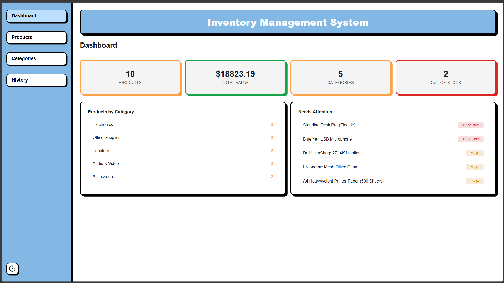
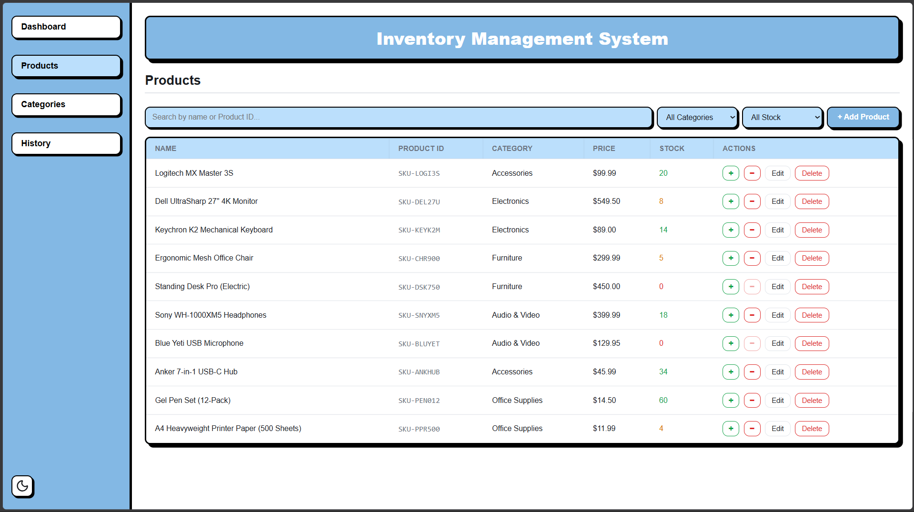
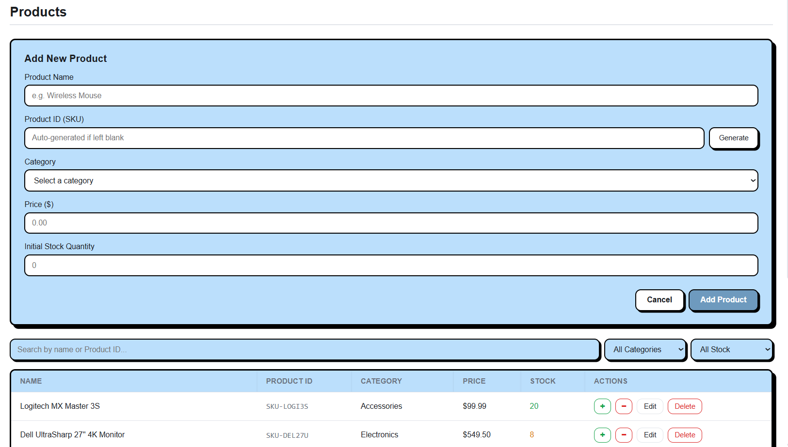
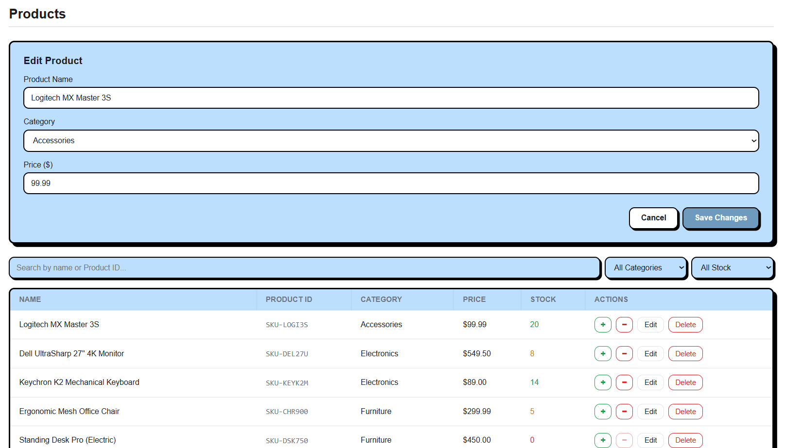
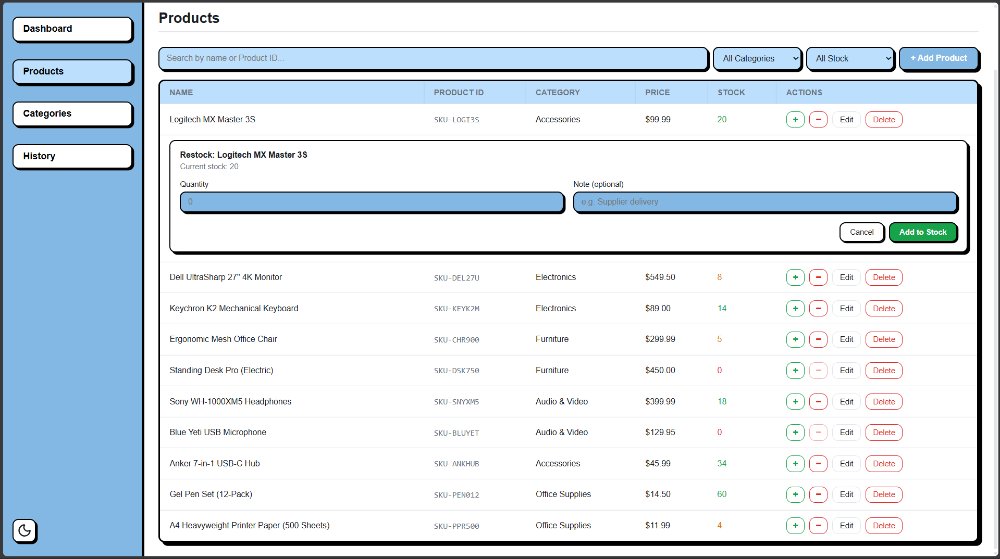
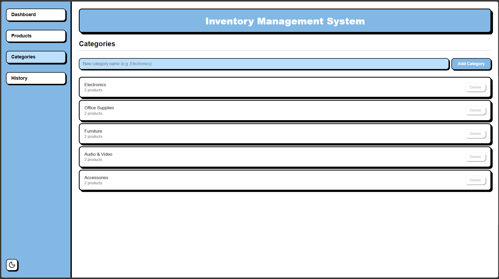
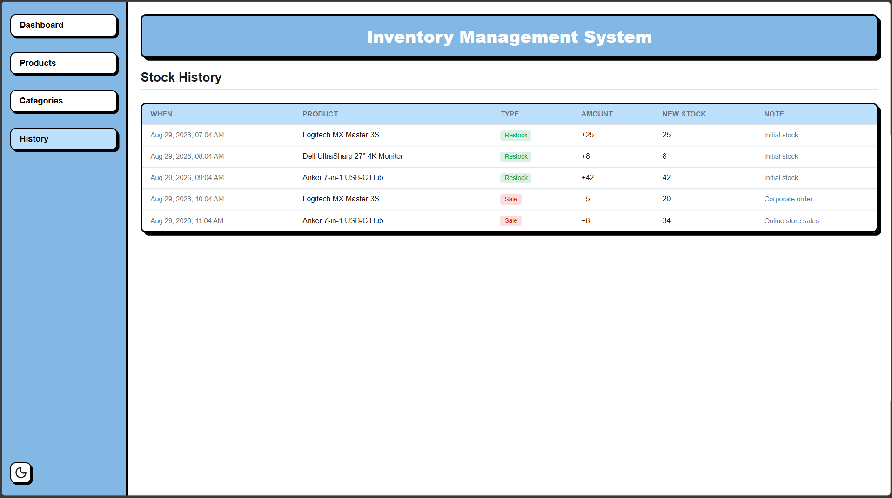
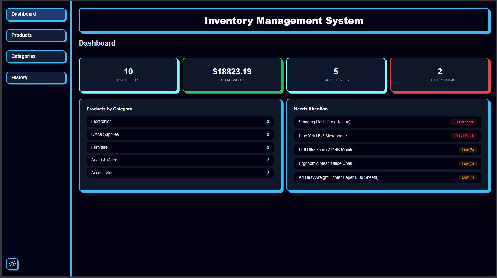

# Inventory Management System (IMS)

A modern, responsive, and intuitive web-based Inventory Management System built with React, Vite, Formik, Yup, and Lucide Icons. The application delivers end-to-end inventory management, dynamic category organization, inline stock adjustments, real-time filtering, audit logging, and dark/light theme customization, all backed by persistent browser local storage.

---

## Table of Contents

- [Project Overview](#project-overview)
- [List of Features Implemented](#list-of-features-implemented)
- [How to Run the Project Locally](#how-to-run-the-project-locally)
- [Screenshots of the Application](#screenshots-of-the-application)

---

## Project Overview

The Inventory Management System (IMS) is designed to streamline stock control and warehouse tracking for small businesses, retail outlets, and personal inventories. Operating as a standalone client-side Single Page Application (SPA), it eliminates the requirement for external databases by persisting all data directly to browser `localStorage`.

### Key Highlights

- **Zero-Backend Architecture:** Instant setup with all products, categories, transaction history, and user settings saved securely in the browser.
- **Data Integrity and Validation:** Comprehensive client-side validation using Formik and Yup prevents invalid product entries, negative quantities, and conflicting records.
- **Referential Integrity:** Prevents accidental deletion of categories currently assigned to active products.
- **Audit Traceability:** Maintains a complete chronological record of all inbound (restock) and outbound (sale) stock movements.
- **Modern User Interface:** Built with modular CSS, sleek typography, responsive layouts, and customizable visual themes.

---

## List of Features Implemented

### 1. Interactive Dashboard and Analytics
- **Live Key Performance Indicator Metric Cards:** Displays summary statistics for Total Products, Total Inventory Valuation ($), Total Categories, and Out-of-Stock count.
- **Category Distribution Breakdown:** Shows real-time product counts across all registered categories.
- **Needs Attention Panel:** Highlights urgent inventory issues, such as out-of-stock items (0 units) and low-stock warnings (less than 10 units).

### 2. Product Management (Full CRUD)
- **Product Creation and Editing:** Allows adding and updating product name, SKU identifier, category, unit price, and current stock quantity.
- **Automated SKU Generator:** Generates unique, collision-safe SKU identifiers (`SKU-XXXXXX`) with a single click.
- **Schema Validation:** Strict validation ensures valid text lengths, positive pricing, and non-negative integer stock quantities.
- **Safe Deletion:** Deletion confirmation dialogs safeguard against accidental removal of products.

### 3. Stock Movements and Adjustments
- **Quick Inline Adjustments:** Restock (`+ IN`) or record Sales (`- OUT`) directly from the product table.
- **Stock Depletion Protection:** Disallows sales operations that exceed currently available stock quantities.
- **Audit Transaction Notes:** Allows optional descriptive notes (up to 100 characters) for each adjustment.

### 4. Category Management
- **Dynamic Category Creation:** Enables creation of custom product classifications with uniqueness checks.
- **Active Product Counter:** Tracks the exact number of active products associated with each category.
- **Protected Category Deletion:** Blocks category removal if any existing product is assigned to it.

### 5. Real-Time Search and Multi-Level Filtering
- **Live Text Search:** Filters products instantly by product name or SKU code.
- **Category Filter:** Filters products by a specific selected category.
- **Stock Status Filter:** Segregates inventory into All, In Stock, and Out of Stock views.

### 6. Stock Movement Audit History
- **Detailed Transaction Log:** Tracks every stock adjustment (initial inventory, restocks, and sales) with precise timestamps, quantity changes, final balances, and audit notes.

### 7. Theme Customization (Dark and Light Mode)
- **One-Click Theme Toggle:** Switches between polished Dark and Light themes.
- **Persistent Preferences:** Automatically preserves the chosen theme mode across page reloads.

### 8. User Feedback and Notifications
- **Toast Alerts:** Provides instant contextual notifications using `react-hot-toast` for additions, updates, deletions, and validation errors.

---

## How to Run the Project Locally

Follow these instructions to set up and run the application on your local machine.

### Prerequisites

Ensure the following tools are installed on your computer:
- **Node.js**
- **npm** (included with Node.js)

### Step 1: Clone the Repository

```bash
git clone https://github.com/realthash/Inventory-Management-System.git
cd Inventory-Management-System
```

### Step 2: Navigate to the Application Directory

```bash
cd inventory-management
```

### Step 3: Install Dependencies

```bash
npm install
```

### Step 4: Launch the Development Server

```bash
npm run dev
```

### Step 5: Access the Application

Open your browser and navigate to the URL displayed in your terminal (typically `http://localhost:5173`).

### Available Scripts

Within the `inventory-management` directory, you can execute the following commands:

| Command | Description |
| :--- | :--- |
| `npm run dev` | Starts the Vite development server with Hot Module Replacement (HMR). |
| `npm run build` | Compiles and optimizes assets into the `dist/` directory for production. |
| `npm run preview` | Serves the production build locally for verification. |
| `npm run lint` | Runs ESLint to check for code quality and syntax standards. |

---

## Screenshots of the Application

### 1. Dashboard View
*Key performance indicators, inventory valuation, category distribution, and low stock notifications.*



---

### 2. Product Management and Filter Bar
*Interactive product catalog with real-time search, category dropdown filter, stock status filter, and quick action buttons.*



---

### 3. Add Product Modal
*Validated product creation form with automated SKU generation.*



---

### 4. Edit Product Modal
*Update existing product attributes with immediate validation and feedback.*



---

### 5. Stock Adjustment (Restock / Sale)
*Inline stock adjustment modal with transaction type selection and audit notes.*



---

### 6. Category Management
*Category creation, active product counters, and referential integrity protection.*



---

### 7. Stock Movement Audit History
*Audit log tracking all stock adjustments.*



---

### 8. Dark Mode Interface
*Full application interface in Dark Mode theme.*


